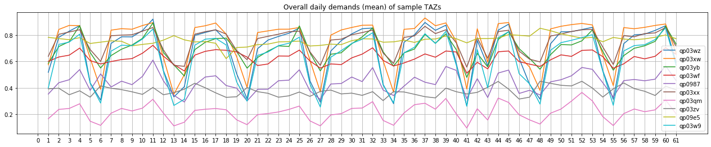

# Predicting Demands of Ride-hailing Services

## Usage

Download or clone the repo, follow step-by-step instructions in the [main notebook](./main.ipynb) to generate forecast outputs.

## Hardware

There is no intensive requirements regarding machines. The [main notebook](./main.ipynb) takes roughly 10 minutes to run on a MacBookPro (2.7 GHz Intel Core i5, RAM 8 GB).

## Environment

- Typical python working environment with Jupyter Lab / Notebook installed should be fine.
- Module requirements are specified in [requirements.txt](./requirements.txt) and the most essential ones are actually [python-geohash](https://github.com/hkwi/python-geohash) and [lightgbm](https://github.com/microsoft/LightGBM).
- A local import is also necessary: `from rdforecast import datasets` when running the notebooks in the cloned repo.
- In order to explore the remaining notebooks, [geopandas](https://github.com/geopandas/geopandas), [scikit-learn](https://github.com/scikit-learn/scikit-learn), [pysal](https://github.com/pysal) will be necessary.

## Data

### Input

- `train.csv`: as provided by the challenge
- `test.csv`: exact same format with train data, containing **14 days** of data up to time T
- `zone_labels.csv`: pre-generated and should be found in ./input/ in the repo. If not, it can be generated from this [notebook](./explore_function_segmentation.ipynb).

### Output

- `output.csv`: exact same format with train data, containing forecast values from T+1 to T+5 for all TAZs

### Annotation

- TAZ: traffic analysis zone, as per `geohash6` in the data
- timestep (T): 15-minute time interval

## Introduction

- This repo develops a LightGBM model to forecast the demands of ride-hailing services given train and test data in the specified format. To run the model, execute the [main notebook](./main.ipynb).
- The model then forecasts the demands for all zones for 5 timesteps succeeding the final timestep in the test dataset, in the exact same format ready to be evaluated with the actual data.
- The other notebooks are mainly the recorded and reproducible processes for data preparation, feature creation, and model development. You are encouraged to read those as well.
- There is also a local module, [rdforecast](./rdforecast/), that provides necessary functions to run the notebooks.
- Last but not least, there is a [brief development report](./REPORT.md) that summarizes the process and the results from this excercise.

## Contact Info

Yuwen Chang: ywchang at nyu dot edu